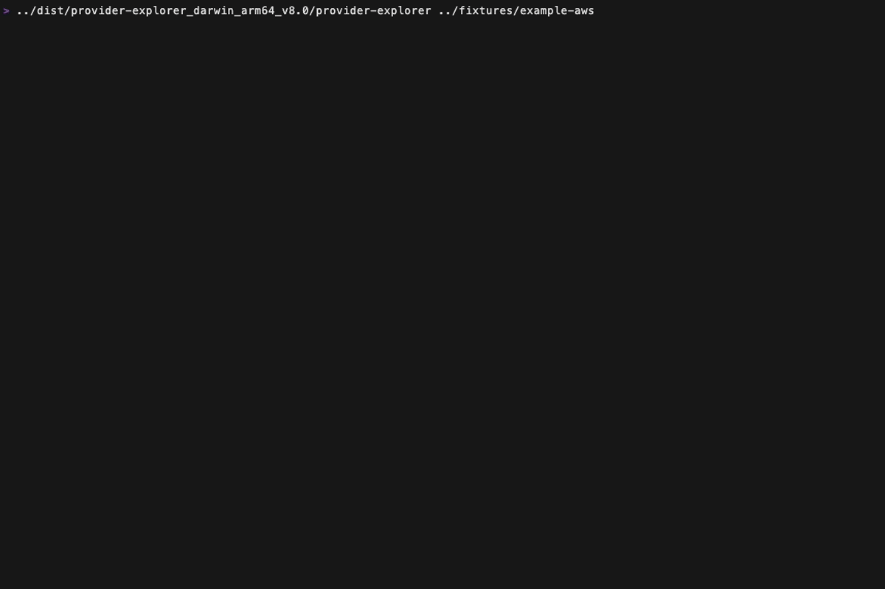

# Provider Explorer

**An interactive Terminal User Interface (TUI) for exploring Terraform provider schemas**

Provider Explorer is a Go-based CLI tool that helps developers navigate, understand, and work with complex Terraform provider resource schemas. It provides an intuitive interface with fuzzy search, interactive navigation, and built-in transformations to streamline Terraform development workflows.




## 🎯 Purpose & Use Cases

**For Terraform Developers:**
- 🔍 **Schema Discovery**: Quickly explore provider resources, data sources, and functions
- 📚 **Documentation**: Understand resource arguments, attributes, and nested blocks
- 🔄 **Code Generation**: Transform schemas into Terraform variable/output blocks
- ⚡ **Rapid Development**: Find the right resources without context switching to documentation

**For DevOps Engineers:**
- 🏗️ **Infrastructure Planning**: Discover available resources before writing Terraform
- 📝 **Template Creation**: Generate boilerplate Terraform code from schemas  
- 🔧 **Troubleshooting**: Understand resource structures when debugging configurations
- 📋 **Standards Creation**: Build consistent variable/output patterns across teams

## 🚀 Features

### Interactive Navigation
- **Fuzzy Search**: Type to filter providers, resources, and attributes in real-time
- **Multi-Level Browsing**: Navigate from providers → resource types → detailed schemas
- **Responsive Layout**: Adapts to different terminal sizes and preferences
- **Keyboard Navigation**: Efficient navigation with intuitive key bindings

### Schema Exploration
- **Four Resource Categories**: Data Sources, Resources, Ephemeral Resources, Provider Functions
- **Detailed Schema Views**: Browse arguments (inputs) and attributes (outputs) separately
- **Nested Block Support**: Navigate complex nested resource structures
- **Type Information**: See data types, requirements (required/optional), and descriptions

### Built-in Transformations
- **Arguments → Variables**: Convert resource arguments to Terraform variable blocks
- **Attributes → Outputs**: Generate output blocks from resource attributes
- **HCL Generation**: Ready-to-use Terraform code with proper syntax and formatting

### Developer Experience
- **Provider Caching**: Intelligent schema caching to avoid repeated API calls
- **Auto-Detection**: Automatically detects Terraform vs OpenTofu installations
- **Configuration Validation**: Ensures valid Terraform configurations before starting
- **Fast Startup**: Quick initialization with cached provider schemas

## 🛠️ Tech Stack

### Core Technologies
- **Language**: Go 1.24.4
- **TUI Framework**: [Bubble Tea](https://github.com/charmbracelet/bubbletea) - Event-driven TUI framework
- **Styling**: [Lipgloss](https://github.com/charmbracelet/lipgloss) - Terminal styling library
- **CLI Framework**: [Cobra](https://github.com/spf13/cobra) - Command-line interface framework

### Key Dependencies
- **Terraform Integration**:
  - `github.com/hashicorp/terraform-json` - Schema parsing and data structures
  - `github.com/hashicorp/terraform-config-inspect` - Configuration analysis
  - `github.com/zclconf/go-cty` - Terraform type system support

- **UI Components**:
  - `github.com/charmbracelet/bubbles` - Pre-built UI components
  - `github.com/sahilm/fuzzy` - Fuzzy string matching for search
  - `github.com/atotto/clipboard` - Cross-platform clipboard support

- **Testing & Quality**:
  - `github.com/charmbracelet/x/exp/teatest` - TUI integration testing
  - `github.com/gkampitakis/go-snaps` - Snapshot testing for UI consistency
  - `github.com/stretchr/testify` - Testing utilities and assertions

### Architecture
```
├── cmd/           # CLI command definitions and entry points
├── internal/
│   ├── config/    # Configuration detection and management
│   ├── schema/    # Provider schema types and processing
│   ├── terraform/ # Terraform/OpenTofu integration and caching
│   └── ui/        # TUI components and application logic
├── ui_test/       # Integration tests for UI workflows
└── testdata/      # Test fixtures and schema samples
```

## 📦 Installation

### Prerequisites
- Go 1.24.4 or later
- Terraform or OpenTofu installed and accessible in PATH
- A Terraform configuration directory to explore

### Building from Source
```bash
# Clone the repository
git clone https://github.com/terraconstructs/provider-explorer.git
cd provider-explorer

# Build using GoReleaser (recommended)
make build

# Or build with Go directly
go build -o provider-explorer .

# Install to $GOPATH/bin
make install
```

### Using Pre-built Binaries

Download the latest release for your platform from the [releases page](https://github.com/TerraConstructs/provider-explorer/releases/latest).

#### macOS
```bash
# Apple Silicon (M1/M2/M3)
curl -L -o provider-explorer.tar.gz https://github.com/TerraConstructs/provider-explorer/releases/latest/download/provider-explorer_Darwin_arm64.tar.gz
tar -xzf provider-explorer.tar.gz
sudo mv provider-explorer /usr/local/bin/

# Intel-based Mac
curl -L -o provider-explorer.tar.gz https://github.com/TerraConstructs/provider-explorer/releases/latest/download/provider-explorer_Darwin_x86_64.tar.gz
tar -xzf provider-explorer.tar.gz
sudo mv provider-explorer /usr/local/bin/
```

#### Linux
```bash
# ARM64 (aarch64)
curl -L -o provider-explorer.tar.gz https://github.com/TerraConstructs/provider-explorer/releases/latest/download/provider-explorer_Linux_arm64.tar.gz
tar -xzf provider-explorer.tar.gz
sudo mv provider-explorer /usr/local/bin/

# x86_64 (Intel/AMD)
curl -L -o provider-explorer.tar.gz https://github.com/TerraConstructs/provider-explorer/releases/latest/download/provider-explorer_Linux_x86_64.tar.gz
tar -xzf provider-explorer.tar.gz
sudo mv provider-explorer /usr/local/bin/
```

#### Windows
Download the appropriate `.zip` file for your architecture:
- **ARM64**: [provider-explorer_Windows_arm64.zip](https://github.com/TerraConstructs/provider-explorer/releases/latest/download/provider-explorer_Windows_arm64.zip)
- **x86_64**: [provider-explorer_Windows_x86_64.zip](https://github.com/TerraConstructs/provider-explorer/releases/latest/download/provider-explorer_Windows_x86_64.zip)

Extract the `.zip` file and add the `provider-explorer.exe` to your PATH.

#### Using GitHub CLI
```bash
# Download for your current platform automatically
gh release download --repo TerraConstructs/provider-explorer --pattern '*$(uname -s)_$(uname -m)*'

# Or download a specific version
gh release download v1.0.0 --repo TerraConstructs/provider-explorer
```

#### Verify Installation
```bash
# Verify the binary works
provider-explorer version

# Verify checksum (optional)
curl -L -o checksums.txt https://github.com/TerraConstructs/provider-explorer/releases/latest/download/checksums.txt
shasum -a 256 --check checksums.txt --ignore-missing
```

## 🎮 Usage

### Basic Usage
```bash
# Explore current directory's Terraform configuration
./provider-explorer

# Explore specific directory
./provider-explorer ./path/to/terraform/config

# Get help
./provider-explorer --help
```

### Interactive Workflow
1. **Start the Application**: Launch with a Terraform configuration directory
2. **Provider Selection**: Browse or search available providers
3. **Resource Category**: Choose from Data Sources, Resources, Ephemeral Resources, or Provider Functions  
4. **Resource Selection**: Select specific resource types with fuzzy search
5. **Schema Exploration**: Navigate between Arguments and Attributes views
6. **Transformation**: Generate HCL code with built-in transformers
7. **Copy to Clipboard**: Copy generated code for immediate use

### Keyboard Shortcuts
- **Navigation**: Arrow keys, Tab, Enter
- **Search**: `/` to start filtering, Escape to clear
- **Views**: `a` to toggle between Arguments/Attributes
- **Actions**: Space to select/deselect items
- **Exit**: `q` or Ctrl+C

## 🔧 Development

### Development Workflow

**⚠️ CRITICAL**: This TUI application uses **test-driven development**. Manual execution is prohibited during development.

#### Required Development Sequence:
1. **Define Changes**: Specify what UI behavior changes are needed
2. **Review Tests**: Identify affected teatest integration tests in `ui_test/`
3. **Update Tests**: Modify test workflows to match new behavior
4. **Review Snapshots**: Examine snapshot changes for visual regressions
5. **Build**: Run `make build` to ensure compilation
6. **Format**: Run `make fmt` for code formatting
7. **Never Run Manually**: Do not execute `./provider-explorer` during development

### Testing Strategy

**Comprehensive Testing Coverage:**
- **31 Integration Tests**: Full UI workflow coverage using teatest
- **Snapshot Testing**: Visual regression detection for multiple screen sizes
- **Component Tests**: Individual UI component validation
- **Export Tests**: HCL transformation functionality validation

#### Test Commands
```bash
# All tests (unit + integration)
make test

# Unit tests only (fast)
make test-unit  

# Integration tests only (teatest)
make test-integration

# Tests with coverage report
make test-coverage

# Quick development tests
make test-short
```

#### Testing Patterns
```go
// ✅ CORRECT: Always wait for UI state
teatest.WaitFor(t, tm.Output(), func(b []byte) bool {
    return bytes.Contains(b, []byte("expected content"))
}, teatest.WithDuration(5*time.Second))

// ❌ WRONG: Direct output reading
output := tm.Output() // Unreliable for async UI
```

### Code Quality
```bash
# Format Go code
make fmt

# Clean build artifacts
make clean

# View all available commands
make help
```

## 📁 Project Structure

### Key Directories
- **`cmd/`**: CLI command definitions and application entry points
- **`internal/config/`**: Terraform configuration detection and validation
- **`internal/terraform/`**: Provider schema loading, caching, and binary detection
- **`internal/ui/`**: TUI application logic, components, and transformations
- **`ui_test/`**: Comprehensive integration tests for all UI workflows
- **`testdata/`**: Test fixtures and minimal provider schemas
- **`fixtures/`**: Example Terraform configurations for testing

### Testing Architecture
- **Component Tests**: `internal/ui/tree/model_test.go` - Individual component snapshots
- **Integration Tests**: `ui_test/*.go` - Full application workflow testing
- **Snapshot Files**: `__snapshots__/` - Visual regression detection data
- **Test Utilities**: `internal/ui/tree/testutil/` - Testing helper functions

## 🤝 Contributing

### Development Setup
1. **Fork and Clone**: Fork the repository and clone your fork
2. **Install Dependencies**: Run `go mod download`
3. **Understand Testing**: Read the testing strategy in `CLAUDE.md`
4. **Make Changes**: Follow the test-driven development workflow
5. **Run Tests**: Ensure all tests pass before submitting

### Pull Request Process
1. **Create Feature Branch**: Branch from `main` with descriptive name
2. **Update Tests**: Modify relevant teatest workflows for changes
3. **Review Snapshots**: Ensure UI changes are intentional
4. **Format Code**: Run `make fmt` before committing
5. **Submit PR**: Include clear description of changes and test coverage

### Code Standards
- **Go Formatting**: Use `gofmt` and `goimports` for consistent formatting
- **Testing Required**: All UI changes must include corresponding test updates
- **Documentation**: Update README and CLAUDE.md for significant changes
- **Commit Messages**: Use clear, descriptive commit messages

## 📜 License

This project is licensed under the Apache License 2.0 - see the [LICENSE](LICENSE) file for details.

## 🙏 Acknowledgments

- **Charm Bracelet**: For the excellent Bubble Tea TUI framework and ecosystem
- **HashiCorp**: For Terraform and the provider schema APIs
- **Go Community**: For the robust standard library and development tools

---

**Questions or Issues?** Please open an issue on GitHub or contribute to the project!